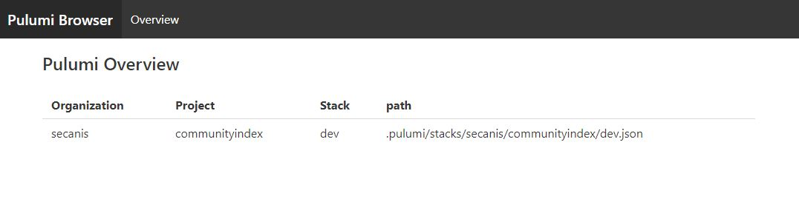

## Pulumi Browser

> currently under development ⌨

S3 Pulumi browser to control and verify your deployments in a visual way instead of only use the cli output.



## Required Pulumi Structure

If you setup a new stack on Pulumi you have to set a name, see the documentation [here](https://www.pulumi.com/docs/intro/concepts/stack/#create-stack).
Pulumi describes there that you can name your stacks in the following principle `orgName/projectName/stackName`.
This app uses this behavior but allows you to add multiple subprojects splited by a `/`.

If you use an other abstraction you may hit some mismatched naming in the app.

## Example S3

Following you get an example setup with [Minio](https://hub.docker.com/_/minio) S3 storage.

> TBD

## How to run the app

### Configuration

You should configure the following environment variables to run the app correctly:

```bash
S3_URL
S3_ACCESS_KEY
S3_SECRET_KEY
S3_BUCKET
```

### Development

```bash
npm install

# or

docker build -t secanis/pulumibrowser .
```

```bash
# development
npm run start

# watch mode
npm run start:dev

# production mode
npm run start:prod

# or
docker run -e S3_URL={URL} -e S3_ACCESS_KEY={ACCESS_KEY} -e S3_SECRET_KEY={SECRET} -e S3_BUCKET=pulumi -p 3000:3000 secanis/pulumibrowser
```

## License

[MIT licensed](LICENSE).
